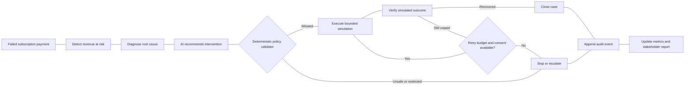
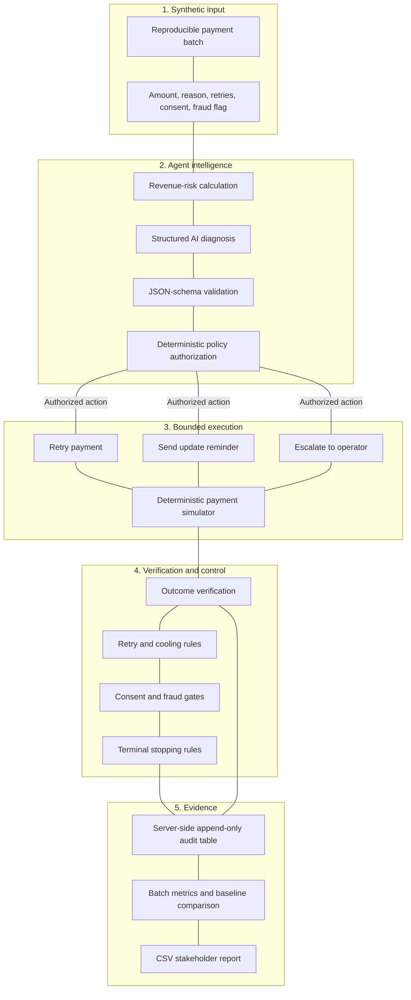

# RecoverIQ

## AI Revenue Recovery for Track 03

> **Find revenue that is slipping away and win it back — safely, measurably, and with a complete audit trail.**

RecoverIQ is a policy-controlled AI revenue-recovery agent for failed subscription payments. It detects synthetic revenue at risk, diagnoses the likely payment problem, recommends the least aggressive effective intervention, validates that recommendation against deterministic policies, executes a bounded simulated action, verifies the simulated result, and stops or escalates when automation should end.

This project is built for **Track 03: AI Revenue Recovery**. It focuses on one clear wedge: **failed-subscription-payment recovery**. Checkout abandonment, B2B receivables, mandate retries, and voice recovery are possible extensions, but they are intentionally outside the first version so that the core recovery loop remains measurable and demonstrable.

## Why this matters

Revenue loss rarely happens in one clean step. A recurring payment may fail because of a temporary bank issue, insufficient funds, an expired card, a fraud signal, or an exhausted retry budget. A useful agent must do more than identify the failure. It must choose an appropriate intervention, execute it within strict limits, verify the outcome, and explain every decision afterward.

RecoverIQ closes that loop on a reproducible synthetic batch without moving real money.

## The Track 03 loop



The model is responsible for contextual diagnosis and recommendation. The deterministic policy layer remains the authority for consent, fraud restrictions, retry limits, cooling periods, approvals, terminal stops, and allowed actions.

## End-to-end architecture



## How one case works

| Stage | Example behavior |
|---|---|
| Detect | A synthetic invoice of ₹2,499 is unpaid and marked as revenue at risk. |
| Diagnose | The agent sees a temporary bank degradation with one previous retry. |
| Recommend | Structured AI recommends a bounded payment retry with a clear rationale. |
| Validate | The policy engine checks that the retry count, cooling period, consent, fraud state, and approval requirements allow the action. |
| Execute | The deterministic simulator runs the retry; no live payment gateway is called. |
| Verify | The simulator returns success, temporary failure, permanent failure, or contained simulator error. |
| Continue or stop | The agent closes a recovered case or stops and escalates when the retry budget is exhausted. |
| Record | The decision, rationale, policy rule, result, next step, and stop reason are written to the audit trail. |

## Recovery paths and guardrails

| Case condition | Path | Permitted intervention | Stop or escalation rule |
|---|---|---|---|
| Temporary bank or network failure | Recoverable | Bounded payment retry | Stop after the retry budget is exhausted |
| Insufficient funds or expired card | Customer action | Payment-method update reminder | Respect cooling period and contact consent |
| Fraud signal | Restricted | No automatic payment action | Escalate to human review |
| Missing contact consent | Human review | No customer message | Escalate or mark restricted |
| Repeated failures | Human review | Operator escalation | No further automatic retries |
| Simulator error | Contained failure | No recovery claim | Preserve the error in the audit trail |
| Successful payment | Closed | No further action | Terminal success state |

The policy engine prevents arbitrary model actions. The AI may recommend only known bounded actions, and the deterministic validator can overrule the recommendation before simulation.

## What the dashboard measures

RecoverIQ runs the agent over a reproducible batch and compares it with a one-retry synthetic baseline.

| Metric | Meaning |
|---|---|
| Synthetic revenue at risk | Total amount represented by eligible synthetic failed payments |
| Simulated amount recovered | Amount verified as recovered by the deterministic simulator |
| Recovery rate | Simulated recovered value divided by synthetic revenue at risk |
| Baseline lift | Dynamic comparison with the one-retry synthetic baseline |
| Recoveries | Number of cases that reach simulated success |
| Escalations | Cases routed to an operator rather than automated further |
| Safe stops | Cases stopped because policy says automation should end |
| Unrecovered value | Synthetic value that remains unpaid after the bounded workflow |
| Policy compliance | Percentage of decisions that respect configured guardrails |

All currency values are explicitly **synthetic or simulated**. The application does not accept live payment credentials, call a payment processor, or move real money.

## Auditability

Every decision and action creates an append-only audit event containing:

```text
case ID
UTC timestamp
event kind
diagnosis
action and rationale
confidence
policy rule
approval status
execution result
next step
stop reason
policy-validation result
```

The dashboard reads the audit timeline from the server-side `recoveryAuditEvents` table. The client may maintain a local fallback for resilience, but the persisted server audit is the primary source when available. The same information can be downloaded through the **Export CSV** action for stakeholder review.

## Structured AI design

The AI layer is server-side and returns a strict JSON schema rather than free-form text. A recommendation contains:

```json
{
  "path": "recoverable",
  "action": "retry_payment",
  "diagnosis": "Temporary bank degradation",
  "rationale": "The failure is transient and remains within the retry budget.",
  "confidence": 0.87,
  "policyRule": "R-02",
  "requiresApproval": false,
  "nextStep": "Verify payment result after retry",
  "stopReason": ""
}
```

The server validates the structure and then calls the deterministic policy authorizer. If the model recommends an unsafe action, the policy engine replaces it with the appropriate safe decision, such as escalation or stopping.

## Simulation model

The simulator is deterministic and reproducible. Each synthetic payment case contains:

```text
case ID
customer and subscription context
amount
plan
failure reason
retry count
customer-contact consent
fraud flag
recoverability ground truth
outcome seed
```

The ground-truth simulator uses the recoverability value and outcome seed to produce repeatable outcomes. This makes it possible to measure the agent across a batch and compare it fairly with a baseline strategy without claiming live merchant impact.

## Demo walkthrough

1. Open the RecoverIQ control room and confirm that the application is in **Simulation mode**.
2. Review the synthetic revenue at risk and simulated recovery metrics.
3. Click **Run recovery batch**. The batch requests structured AI recommendations, validates them through deterministic policy controls, and runs bounded simulations.
4. Open a transient-failure case to show diagnosis, recommendation, bounded retry, verification, and audit events.
5. Open a missing-consent or expired-card case to show customer-action routing and contact protection.
6. Open a fraud-flagged or retry-exhausted case to show restricted handling, stopping, and operator escalation.
7. Compare the dynamic agent result with the one-retry synthetic baseline.
8. Use **Export CSV** to download recovery outcomes and audit events for stakeholder review.

A recommended judging statement is:

> "RecoverIQ does not retry everything. It uses AI to understand the case, deterministic policy to control the action, simulation to verify the result, and an audit trail to explain why it acted or stopped."

## Project structure

```text
client/src/pages/Home.tsx       Control-room dashboard and interactions
server/routers.ts               Structured AI and audit tRPC procedures
server/db.ts                    Server-side audit persistence helpers
shared/recovery.ts              Types, simulator, policy engine, metrics, and CSV export
drizzle/schema.ts               Recovery audit-event database schema
server/recovery.test.ts         Policy, simulator, AI-validation, and metric tests
server/audit.test.ts            Database-backed audit persistence test
demo/pitch_script.md             Track 03 presentation narrative
```

## Local development

Install dependencies and start the application:

```bash
pnpm install
pnpm dev
```

Run validation:

```bash
pnpm check
pnpm test
pnpm build
```

The application requires the project's configured database and built-in server-side AI environment variables. Database schema changes are represented in `drizzle/schema.ts` and the generated migration files.

## Safety boundary

RecoverIQ is a buildathon simulation platform. It is not connected to a live payment processor and must not be used to process real payments without a separate production security, compliance, consent, and payment-integration review. The current application intentionally keeps recovery actions inside a deterministic simulator.

## Track 03 checklist

| Track requirement | RecoverIQ evidence |
|---|---|
| Detect revenue at risk | Synthetic batch risk calculation |
| Diagnose the cause | Structured AI diagnosis and confidence |
| Choose the intervention | AI recommendation behind policy authorization |
| Execute the workflow | Bounded retry, reminder, and escalation simulations |
| Measure recovered money | Batch-level simulated recovery value and rate |
| Compliant escalation | Consent, fraud, approval, cooling, and human-review gates |
| Stopping rules | Retry exhaustion, terminal outcomes, and safe stops |
| Audit trail | Server-side append-only event log and CSV export |
| No real-money movement | Deterministic test-only simulator |

## License

This repository is a buildathon prototype for demonstrating AI-assisted revenue recovery with policy-controlled simulation.
